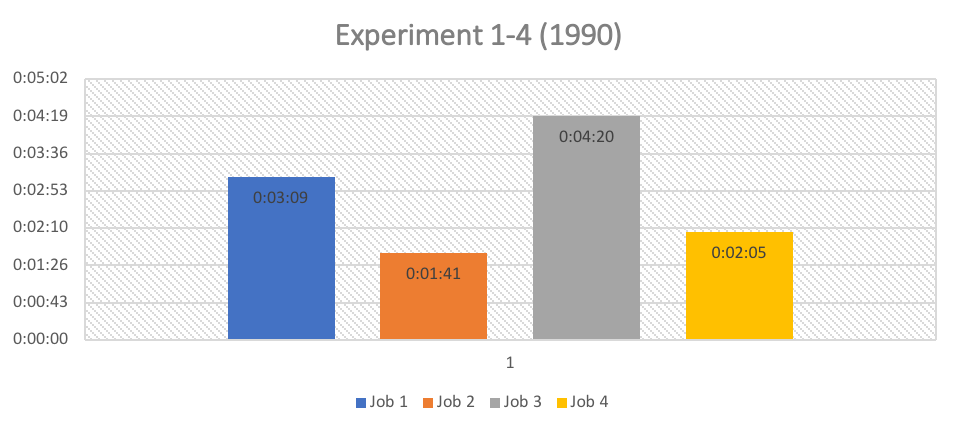

# Big-Data-Analysis

With the default setting that is the combiner OFF and the compressor also OFF, we observed that there was not a significant difference of in the execution time of the files. Although I observed some difference in execution time, but that may be just because of the average time of Maps and reduce time. Job 3 took the highest time to complete as out of 4 allocated Reducer I got killed and also 1 of the Mapper was also killed.